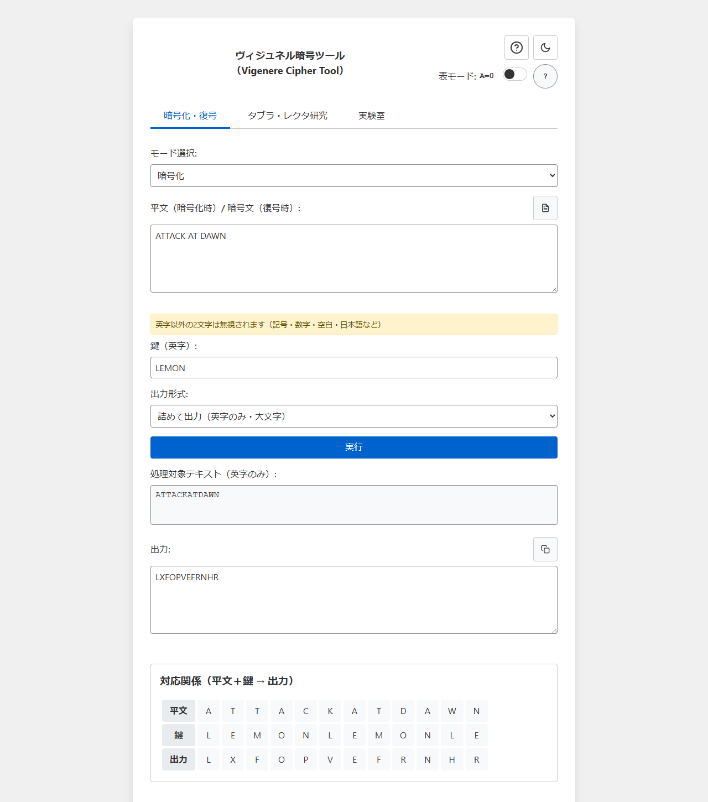
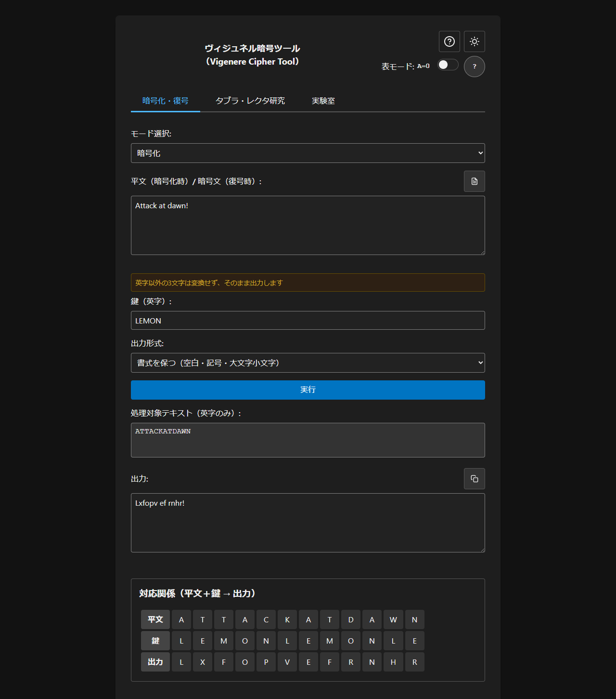
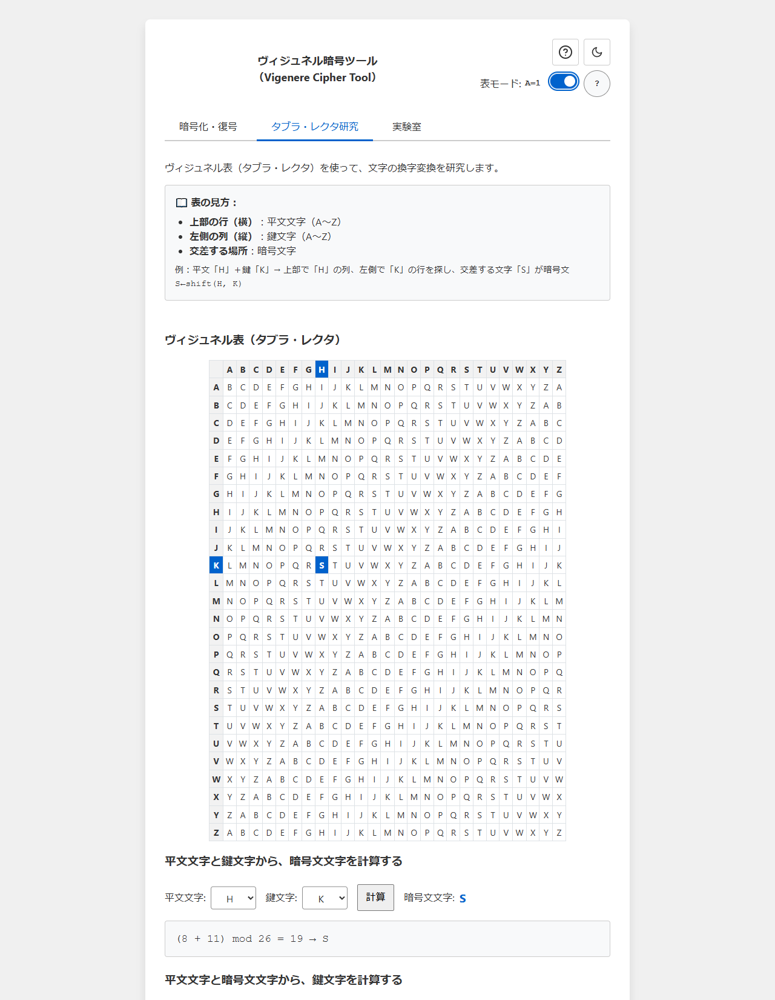
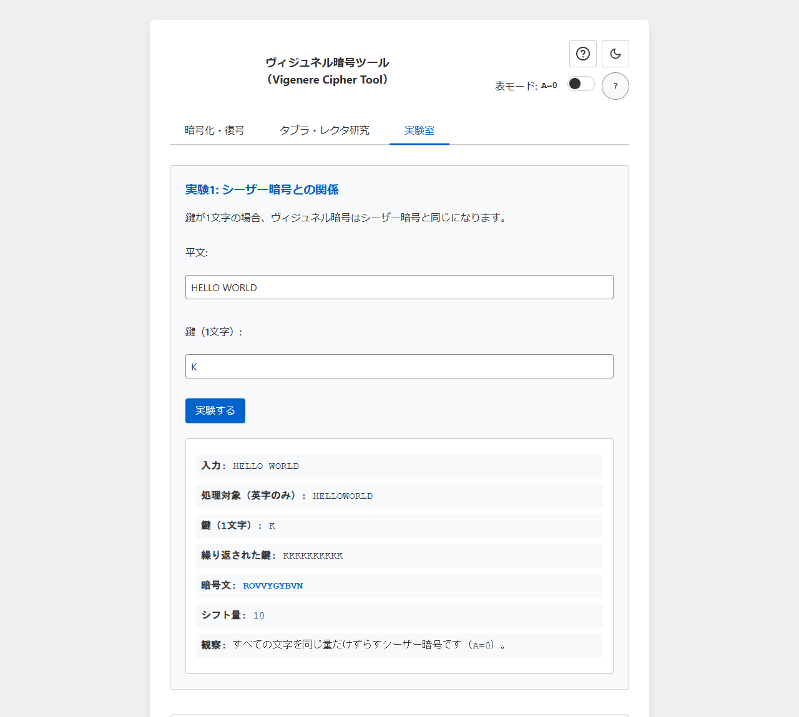

# Vigenere Cipher Tool - Learn Classical Cryptography

English · [日本語](README.md)


[](https://ipusiron.github.io/vigenere-cipher-tool/)

**Day017 - 100 Security Tools Built with Generative AI**

Vigenere Cipher Tool encrypts and decrypts with the Vigenère cipher inside your browser and shows how each
letter maps to the next. Three tabs cover the cipher itself, a study of the tabula recta, and experiments with
the Caesar cipher and the one-time pad.

---

## 🌐 Demo

👉 [https://ipusiron.github.io/vigenere-cipher-tool/](https://ipusiron.github.io/vigenere-cipher-tool/)

---

## 📸 Screenshots


> *ATTACK AT DAWN encrypted in A=0 mode, with the plaintext, key, and output lined up.*


> *The format that keeps spaces and letter case. The validation messages show up in the dark theme too.*


> *The arithmetic that turns H and K into S, with the crossing cell highlighted.*


> *HELLO WORLD with the key K, and a shift amount of 10.*

---

## ✨ Features

### 📝 Tab 1: encrypt and decrypt

**🔐 The cipher itself**
- **Encrypt and decrypt**: convert plaintext to ciphertext and back
- **Careful input handling**: full-width letters raise an error, other non-letters are ignored (the
  keep-the-layout format passes them through unchanged)
- **File input**:
  - 📁 the file button loads a text file
  - drag and drop loads a file too
  - 📋 one click copies the result
- **Live validation**: warnings and errors follow what you type

**📊 Ways to see the cipher at work**
- **Text that will be processed**: shows only the letters that are actually converted
- **Letter mapping table**: plaintext, key, and output line up in columns
- **Highlighting as you point**: hovering a mapping cell highlights the matching part of the Vigenère table
- **The full Vigenère table**: the 26 by 26 tabula recta stays on screen
- **Sticky headers**: the row labels stay visible while long text scrolls

### 🔬 Tab 2: tabula recta study

**🧮 How encryption works, letter by letter**
- **Encryption study**:
  - pick a plaintext letter (A-Z) and a key letter (A-Z)
  - the ciphertext letter appears at once
  - notation: `ciphertext letter ← shift(plaintext, key)`
- **The arithmetic, step by step**:
  - letters to numbers (A=0 mode: A=0 to Z=25, A=1 mode: A=1 to Z=26)
  - the modulo 26 detail: `(plaintext + key) mod 26` (the same expression in A=1 mode, reading 0 as 26)
  - numbers back to letters

**🔄 Working backwards (decryption study)**
- **Recovering the key letter**:
  - work out which key letter was used from a plaintext letter and a ciphertext letter
  - notation: `key letter ← findKey(plaintext, ciphertext)`
  - the arithmetic: `(ciphertext - plaintext) mod 26` (negative remainders wrap into 0-25; in A=1 mode, 0 reads
    as 26)

**🎯 Interactive learning**
- **Table highlighting**: the letter pair you chose is marked on the Vigenère table
- **Instant recalculation**: the result updates as soon as you change a letter

### 🧪 Tab 3: lab

**🔤 Caesar cipher experiment**
- **What a one-letter key means**: a Vigenère cipher with a one-letter key is the Caesar cipher
- **The shift amount**: see the shift that the key letter produces (0-25 in A=0 mode, 1-26 in A=1 mode)
- **The repeated key**: watch a single letter repeat across the whole text
- **A comparison**: understand the Caesar cipher as a special case of the Vigenère cipher

**🎲 One-time pad experiment**
- **A random key, generated for you**:
  - as long as the letters in the plaintext
  - generated with crypto.getRandomValues, with rejection sampling so no letter is favoured
- **Seeing the idea behind the one-time pad**:
  - get a feel for information-theoretic security
  - understand why the key has to be as long as the plaintext
- **A detailed letter mapping**:
  - every letter pair is drawn out in a table
  - it becomes clear why the key must be used only once

The randomness comes from the browser, and real one-time pad practice (delivering and destroying the key) is
not reproduced here. When the number of letters in the plaintext changes, the key is discarded and the
experiment waits until you generate a new one.

### 🎨 Across the whole interface

**🌙 Theme and display**
- **Japanese and English**: the header button switches the language (`?lang=ja` and `?lang=en` work too, and
  your choice is remembered)
- **Dark mode**: switch between light and dark (the choice is remembered)
- **Table mode (A=0 / A=1)**: switch how the Vigenère table is computed
  - A=0 mode: A=0, B=1, ..., Z=25 (the usual convention, so A+A=A)
  - A=1 mode: A=1, B=2, ..., Z=26 (used in some references, so A+A=B)
- **Responsive design**: works on desktop, tablet, and phone
- **Accessibility**: keyboard navigation, and Esc closes the dialog

**📖 Learning support**
- **A full help dialog**: every feature explained
- **Tooltips**: hover any cell of the Vigenère table for the detail
- **Two levels of message**: warnings (safe to ignore) are separated from errors (which stop the run)

---

## 📖 How to use it

### 📝 Tab 1: encrypting and decrypting

**The basics**
1. **Pick a mode**: choose Encrypt or Decrypt
2. **Enter text**:
   - type it in: the plaintext you want to encrypt, or the ciphertext you want to decrypt
   - load a file: click the 📁 icon and choose one
   - drag and drop: drop a text file straight onto the input box
3. **Enter a key**: type the key in letters (for example `LEMON`)
4. **Run**: press Run and the result appears
5. **Take the result**: the 📋 icon copies it to the clipboard

**Getting the most out of the visuals**
- **Letter mapping table**: check how plaintext, key, and output line up
- **Interactive learning**: point at a mapping cell to see the Vigenère table respond
- **Text that will be processed**: confirm exactly which letters are encrypted

### 🔬 Tab 2: tabula recta study

**Encryption study**
1. **Choose letters**: pick a plaintext letter (A-Z) and a key letter (A-Z) from the menus
2. **Calculate**: the result appears as soon as you choose. The Calculate button does the same thing
3. **Read the arithmetic**: follow each step of the modulo 26 calculation
4. **Watch the table**: the crossing cell is highlighted on the Vigenère table

**Decryption study (working backwards)**
1. **Recover the key**: find the key letter from a plaintext letter and a ciphertext letter
2. **Understand the expression**: learn how `(ciphertext - plaintext) mod 26` works (negative remainders wrap
   into 0-25; in A=1 mode, 0 reads as 26)
3. **Apply it**: see how a known plaintext and ciphertext pair leads to the key

### 🧪 Tab 3: lab

**Caesar cipher experiment**
1. **Enter a plaintext**: type the text you want to encrypt
2. **Set a one-letter key**: choose one letter from A to Z
3. **Run it**: see the result as a Caesar cipher
4. **Compare**: understand the Caesar cipher as a special case of the Vigenère cipher

**One-time pad experiment**
1. **Enter a plaintext**: type the text you want to try
2. **Generate a key**: the button makes a key as long as the letters in the plaintext
3. **Encrypt**: try encryption with a key of the same length
4. **Look at the result**: the letter-by-letter mapping shows why a key must be used only once

### Output formats and input limits

| Output format | What it does |
|---|---|
| Compact | letters only, in uppercase |
| Groups of five letters | the letter result is split into groups of five. It can be pasted back to decrypt |
| Keep the layout | spaces, symbols, digits, and non-ASCII stay, and letter case is preserved |

The input limit is 100,000 characters (UTF-16 code units), and a UTF-8 file may be up to 1MB. Anything longer
is loaded from the beginning only, and the page says so. The mapping shows the first 1,000 letters, while the
output box holds the whole result.
Full-width letters have to be replaced with half-width letters before you run.
Text can also arrive through the URL, as `#text=TOM%20%26%20JERRY` (recommended) or `?text=TOM%20%26%20JERRY`. The part after `#` is
not sent to the server, so the ciphertext does not reach GitHub Pages and is not subject to the URL length limit (GitHub Pages
accepts up to 8,192 bytes for the path and the part after `?`). If both are present, `#` wins. Once it is loaded, `text` is
removed from both `#` and `?` in the URL.

### Worked examples

| Plaintext | Key | Table mode | Output format | Result |
|---|---|---|---|---|
| ATTACK AT DAWN | LEMON | A=0 | Compact | LXFOPVEFRNHR |
| ATTACK AT DAWN | LEMON | A=1 | Compact | MYGPQWFGSOIS |
| ATTACK AT DAWN | LEMON | A=0 | Groups of five letters | LXFOP VEFRN HR |
| Attack at dawn! | LEMON | A=0 | Keep the layout | Lxfopv ef rnhr! |
| Attack at dawn! | LEMON | A=1 | Keep the layout | Mygpqw fg sois! |
| HELLO | KEY | A=0 | Compact | RIJVS |
| HELLO WORLD | K | A=0 | Compact | ROVVYGYBVN |
| CRYPTO IS SHORT FOR CRYPTOGRAPHY | ABCD | A=0 | Compact | CSASTPKVSIQUTGQUCSASTPIUAQJB |

### 💡 A way to work through it

**One step at a time**
1. **The basics** (tab 1): get used to encrypting and decrypting
2. **The mechanism** (tab 2): study how a single letter is converted
3. **The wider picture** (tab 3): compare the related ciphers

**In practice**
- start with short words and work up to longer text
- try keys of different lengths and watch how the cipher changes
- use the table highlighting to see what is happening
- read the arithmetic to connect it to the mathematics

---

## ⚠️ Where the Vigenère cipher fails

The Vigenère cipher is known as a polyalphabetic substitution cipher that strengthens the Caesar cipher, but
from a present-day view it has clear weaknesses.

### The repeating key creates periodicity

A short key repeats the encryption pattern, and that period shows up in the ciphertext.
The **Kasiski test** uses this to find the key length, after which each slice can be attacked as a Caesar
cipher.

### One leaked key breaks everything

When a key is reused, a single leak exposes every message encrypted with it.
This is the large difference from the **one-time pad**.

### It falls to frequency analysis

Once the key length is known, the ciphertext splits into several Caesar ciphers, so **frequency analysis can
recover the plaintext**.

### No defence against modern attacks

- known-plaintext attack
- chosen-plaintext attack
- chosen-ciphertext attack

The structure of the cipher offers nothing against any of these.

### Letters only

The Vigenère cipher works on **the 26 letters A to Z**, so symbols, digits, and other scripts cannot be
handled directly.

### In short

> The Vigenère cipher suits teaching and learning, but it has no place in present-day communication or
> security.

---

## 🏆 What the tool has been used for

### 🎯 Ways of using this tool in particular

- Confirming that a key of length 1 becomes a Caesar cipher (classical-cipher classes): with the one-letter key D, encrypting HELLO gives KHOOR, the same as a Caesar cipher that shifts every letter by 3. You can confirm, moving the table mode, that a Vigenere cipher degenerates to a Caesar cipher when the key has length 1
- Confirming that the key appears as-is in an all-A text (known-plaintext and key-exposure classes): encrypting AAAAAA with the key KEY gives KEYKEY. Because A is a shift of 0, the key shows up in the ciphertext, repeated. It shows that where a stretch of plaintext is fully known, the key is exposed from it
- Confirming that the same plaintext becomes different ciphertext by position (the strength of a polyalphabetic cipher): encrypting HELLOHELLO with the key KEY gives RIJVSFOPJY, where the first HELLO becomes RIJVS and the second becomes FOPJY, different ciphertext, because the key is at a different phase. You can confirm why frequency analysis is harder than against a simple substitution, where the same letter always becomes the same ciphertext

### 🎮 Solving the cipher game Cypher

- [POLYALPHABETIC SUBSTITUTION PUZZLE 01 (Cypher)](https://akademeia.info/?p=36228)
  - uses an A=1 Vigenère table, which this tool covers with table mode A=1
- [POLYALPHABETIC SUBSTITUTION PUZZLE 02 (Cypher)](https://akademeia.info/?p=36245)
- [POLYALPHABETIC SUBSTITUTION PUZZLE 03 (Cypher)](https://akademeia.info/?p=36264)

### 🎤 A live break of a Vigenère ciphertext

- [A talk on visual cryptanalysis of classical ciphers](https://akademeia.info/?p=43255)
  - the tool made it possible to break the ciphertext in real time

---

## 🔬 Technical notes

### Built with
- **Front end**: HTML5, CSS3, vanilla JavaScript (ES6+)
- **Libraries**: none
- **Architecture**: modular, with the JavaScript and the CSS both split by responsibility

### Implementation detail

For the algorithms, the design decisions, and the reasoning behind them, see the technical document.

📚 **[Technical notes - TECHNICAL.md](TECHNICAL.md)** (Japanese)

- the mathematics behind the core algorithm
- the modular architecture
- the CSS design system
- input validation and the visualization engine
- lessons learned while building it


## 🔒 Security and privacy

Everything happens inside the browser, and the tool makes no outbound requests at all.
Input, keys, and output are never stored. localStorage holds only the theme, the table mode, and the language.
The tool still works when storage is unavailable.

The meta CSP limits script-src and style-src to self and sets connect-src to none.
Inline execution and dynamic code evaluation are not allowed, and user input is rendered through DOM APIs.
frame-ancestors has no effect in a meta tag, so blocking embedding needs a host that can set HTTP headers.

Keys come from crypto.getRandomValues: bytes of 234 and above are discarded before taking the remainder
modulo 26. That rejection sampling removes the bias between letters, but please do not use this tool to
protect anything that matters.

## 🧪 Tests

Run `npm test` on Node 22 or later. There are no dependencies.
GitHub Actions runs the same tests on every push and pull request.
Known answers for the cipher, the arithmetic, the input boundaries, the randomness, the colour contrast, and
the worked examples in the README are all checked.
The two dictionaries are checked as well: the keys match, the substitution names match, the fallback wording
in the HTML matches the Japanese dictionary, and no Japanese is left on the English side.

## 🔗 Related reading

- [Everything About Cryptography](https://akademeia.info/?page_id=157) pp. 71-81 (Japanese)
- [Breaking the Caesar Cipher](https://akademeia.info/?page_id=37037) pp. 90-93 (Japanese)
- [Cracking Codes with Python](https://akademeia.info/?page_id=94) pp. 333-422 (Japanese edition)

---

## 📁 Directory structure

```
vigenere-cipher-tool/
├── .github/
│   └── workflows/
│       └── test.yml        # tests on Node 22
├── .gitignore
├── CLAUDE.md
├── LICENSE
├── README.en.md
├── README.md              # Japanese README
├── TECHNICAL.md
├── assets/
│   ├── screenshot3.png
│   ├── screenshot4.png
│   ├── screenshot5.png
│   └── screenshot6.png
├── css/
│   ├── base/
│   │   └── variables.css
│   ├── components/
│   │   ├── buttons.css
│   │   ├── forms.css
│   │   ├── icons.css
│   │   ├── messages.css
│   │   ├── modal.css
│   │   ├── tables.css
│   │   └── tabs.css
│   ├── layout/
│   │   ├── container.css
│   │   └── grid.css
│   ├── main.css
│   ├── themes/
│   │   ├── dark.css
│   │   └── light.css
│   └── utilities/
│       ├── animations.css
│       └── print.css
├── favicon.svg
├── index.html
├── js/
│   ├── app.js
│   ├── core/
│   │   ├── cipher.js       # the pure cipher and the output formats
│   │   ├── formula.js
│   │   ├── indexing-mode.js
│   │   ├── input.js
│   │   ├── random.js
│   │   ├── utils.js
│   │   └── validation.js
│   ├── features/
│   │   ├── lab-tab.js
│   │   ├── main-tab.js
│   │   └── research-tab.js
│   ├── i18n.js            # the two dictionaries and how they reach the DOM
│   ├── theme-init.js
│   └── ui/
│       ├── dom-elements.js
│       ├── formula-text.js # builds one line of arithmetic in the chosen language
│       ├── message-display.js
│       ├── table-generator.js
│       ├── tabs.js
│       └── theme.js
├── package.json           # no dependencies, npm test
└── test/
    ├── cipher.test.js
    ├── contrast.test.js
    ├── format.test.js
    ├── formula.test.js
    ├── helpers.js
    ├── html.test.js
    ├── i18n.test.js
    ├── input.test.js
    ├── random.test.js
    ├── readme.test.js
    ├── static.test.js
    └── validation.test.js
```

---

## 💻 Requirements

Any modern browser works. Because the code uses ES modules, opening the file over `file://` runs into CORS
restrictions. Serve it as below and open http://localhost:8000/ instead.

### Running it locally
```bash
# clone the repository
git clone https://github.com/ipusiron/vigenere-cipher-tool.git

# move into the directory
cd vigenere-cipher-tool

# start a local server
python -m http.server 8000
```

### Customising it
- **Themes**: edit the light and dark themes under `css/themes/`
- **Design system**: adjust everything from `css/base/variables.css`
- **New features**: the modular structure keeps additions contained
- **Wording**: both languages live in `js/i18n.js`, so a new language is a matter of adding a dictionary

### Technical detail
See **[TECHNICAL.md](TECHNICAL.md)** (Japanese) for the implementation.

---

## 📄 License

MIT License - see the [LICENSE](LICENSE) file

---

## 🛠️ About this tool

This tool was built as part of the project *100 Security Tools Built with Generative AI*, which publishes one
security-related tool a day for 100 days, with the help of generative AI.

For the project and the other tools, see the page below.

🔗 [https://akademeia.info/?page_id=42163](https://akademeia.info/?page_id=42163)
