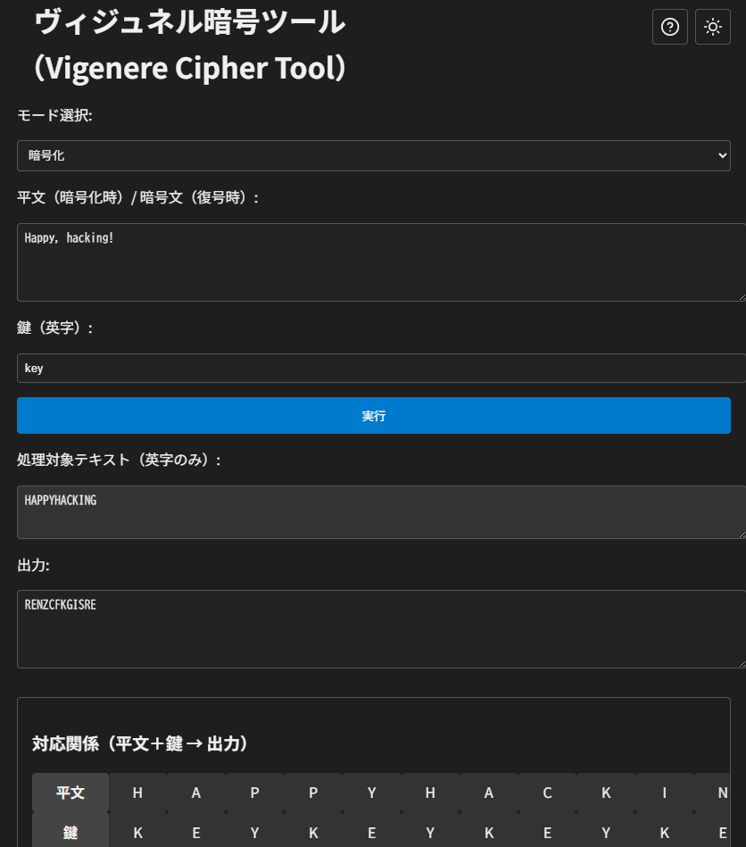

# ヴィジュネル暗号ツール（Vigenère Cipher Tool）

**Day17 - 生成AIで作るセキュリティツール100**

**ヴィジュネル暗号ツール（Vigenère Cipher Tool）** はヴィジュネル暗号ツールの暗号化・復号を行うWebベースのツールです。

暗号化のプロセスを視覚的に理解できるように設計されています。

---
## 🌐 デモページ

👉 [https://ipusiron.github.io/vigenere-cipher-tool/](https://ipusiron.github.io/vigenere-cipher-tool/)

---
## 📸 スクリーンショット

以下は実際の画面例です。

>
>
> *ヴィジュネル暗号の暗号例*

---
## ✨ 機能

### 基本機能
- **暗号化・復号**: 平文の暗号化と暗号文の復号に対応
- **自動文字処理**: 英字以外の文字（数字、記号、空白など）を自動的に除外
- **大文字・小文字対応**: 入力の大文字・小文字を区別せず処理

### 視覚化機能
- **処理対象テキスト表示**: 実際に暗号化・復号される英字のみのテキストを表示
- **対応関係の可視化**: 平文・鍵・出力の文字の対応関係を表形式で表示
- **インタラクティブハイライト**: 対応関係の文字にマウスを合わせると、ヴィジュネル表の該当部分をハイライト
- **ヴィジュネル表**: 26×26の換字表を常時表示
    - タブラレクタ（Tabula Recta）＝アルファベット26文字のずらし表
	- ヴィジュネル表＝タブラレクタを使った暗号のビジュアル説明表現

### UI/UX機能
- **ダークモード対応**: ライト/ダークテーマの切り替え（設定は保存される）
- **ヘルプモーダル**: ツールの使い方と仕様を説明するモーダルウィンドウ
- **レスポンシブデザイン**: 長いテキストでも見やすい横スクロール対応
- **固定ヘッダー**: スクロール時も「平文」「鍵」「出力」のラベルが常に表示

## 📖 使い方

1. **モード選択**: 「暗号化」または「復号」を選択
2. **テキスト入力**: 暗号化したい平文、または復号したい暗号文を入力
3. **鍵の入力**: 暗号化・復号に使用する鍵を英字で入力（例: LEMON）
4. **実行**: 「実行」ボタンをクリックすると結果が表示

---
## 🔧 技術仕様

### 使用技術
- HTML5
- CSS3（CSS変数、Grid Layout、アニメーション）
- Vanilla JavaScript（ES6+）

### ファイル構成
```
├── index.html      # メインHTMLファイル
├── script.js       # 暗号化ロジックとUI制御
├── style.css       # スタイルシート（テーマ対応）
├── README.md       # このファイル
├── CLAUDE.md       # Claude Code向けの開発ガイド
├── LICENSE         # MITライセンスファイル
└── assets/         # 画像などのアセット
    └── screenshot.png  # スクリーンショット画像
```

### 暗号化アルゴリズム
- 標準的なヴィジュネル暗号の実装
- モジュロ26演算による文字シフト
- 鍵の自動繰り返し機能

## 💻 開発者向け情報

### オンラインデモを実行

WebブラウザーでGitHub Pageのデモページを開いてください。

### ローカルでの実行
```bash
# リポジトリをクローン
git clone https://github.com/ipusiron/vigenere-cipher-tool.git

# ディレクトリに移動
cd vigenere-cipher-tool

# ブラウザーで index.html を開く
```

### カスタマイズ
- `style.css`のCSS変数でテーマカラーをカスタマイズ可能
- `script.js`の`sanitize()`関数で文字フィルタリングルールを変更可能

---

## ⚠️ ビジュネル暗号の弱点

ビジュネル暗号は、シーザー暗号を強化した多表式換字暗号として知られていますが、現代の観点からは以下のような明確な弱点を持ちます。

### 鍵の繰り返しによる周期性

短い鍵を使うと、暗号化のパターンが繰り返されるため、暗号文にも周期性が現れます。  
この性質を利用して、**カシスキーテスト（Kasiski Test）** により鍵長を特定し、各部分をシーザー暗号として分解できます。

### 鍵が漏れるとすべて破られる

鍵が再利用される場合、一度でも漏洩すると同じ鍵で暗号化されたメッセージはすべて復号可能です。  
これは **ワンタイムパッド（使い捨て鍵）** との大きな違いです。

### 頻度解析に弱い

鍵の長さが分かった場合、暗号文を複数のシーザー暗号に分割できるため、**頻度解析によって平文を逆算**される危険性があります。

### 現代的攻撃への耐性がない

- 既知平文攻撃（Known Plaintext Attack）
- 選択平文攻撃（Chosen Plaintext Attack）
- 選択暗号文攻撃（Chosen Ciphertext Attack）

などの基本的な攻撃に対して、暗号構造的に防御手段がありません。

### 非英字への非対応

ビジュネル暗号は原理的に **A〜Zの26文字** に限定されており、記号・数字・日本語などを直接扱うことができません。

### 結論：
> ビジュネル暗号は教育・学習用には適していますが、現代の通信やセキュリティには使用できません。

---

## 🔗 関連リンク

- [『暗号技術のすべて』](https://akademeia.info/?page_id=157) P.71-81
- [『シーザー暗号の解読法』](https://akademeia.info/?page_id=37037) P.90-93
- [『Pythonでいかにして暗号を破るか　古典暗号解読プログラムを自作する本』](https://akademeia.info/?page_id=94) P.333-422

---

## 📄 ライセンス

MIT License - [LICENSE](LICENSE)ファイルを参照

---

## 🛠 このツールについて

本ツールは、「生成AIで作るセキュリティツール100」プロジェクトの一環として開発されました。 このプロジェクトでは、AIの支援を活用しながら、セキュリティに関連するさまざまなツールを100日間にわたり制作・公開していく取り組みを行っています。

プロジェクトの詳細や他のツールについては、以下のページをご覧ください。

🔗 [https://akademeia.info/?page_id=42163](https://akademeia.info/?page_id=42163)
