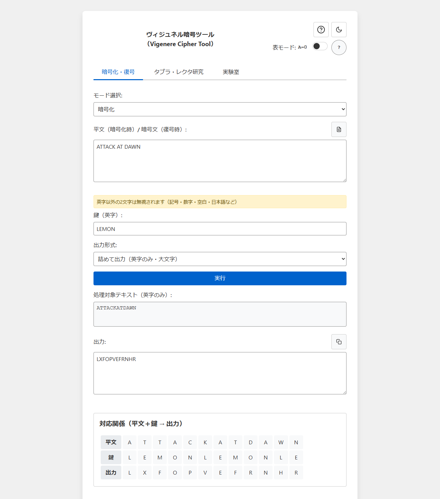
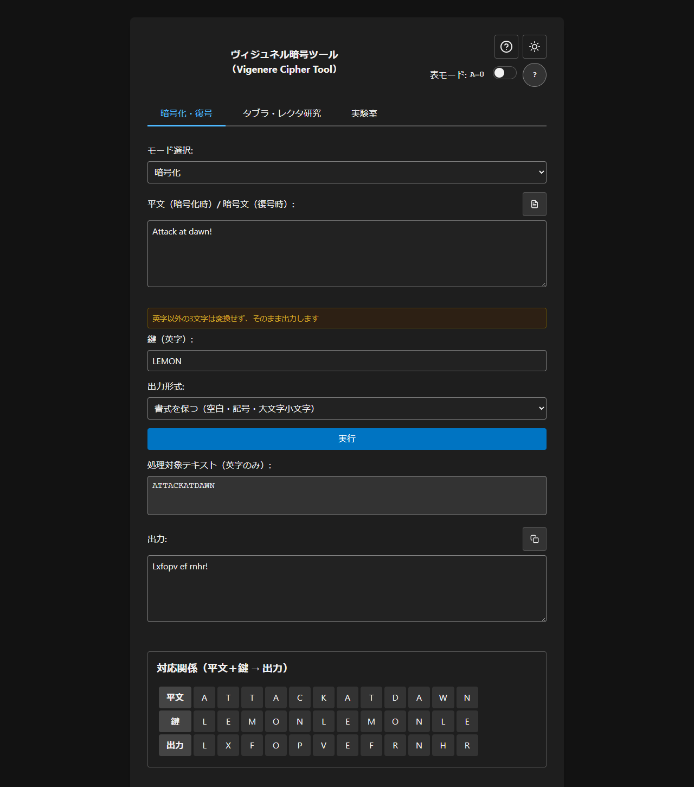
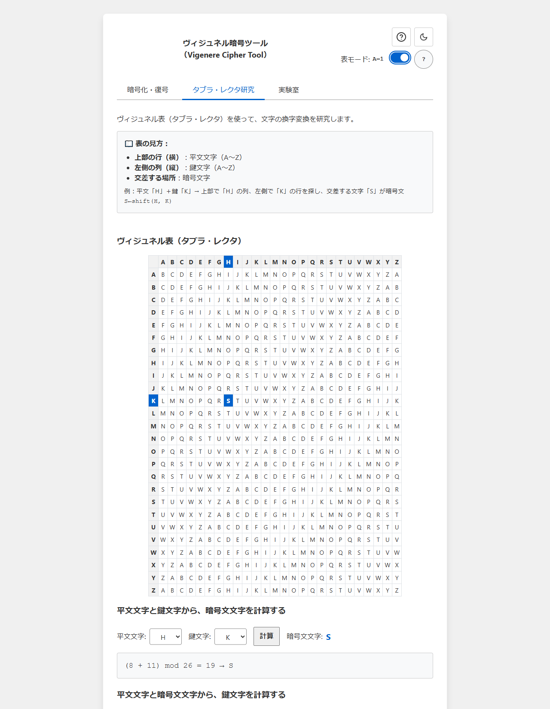
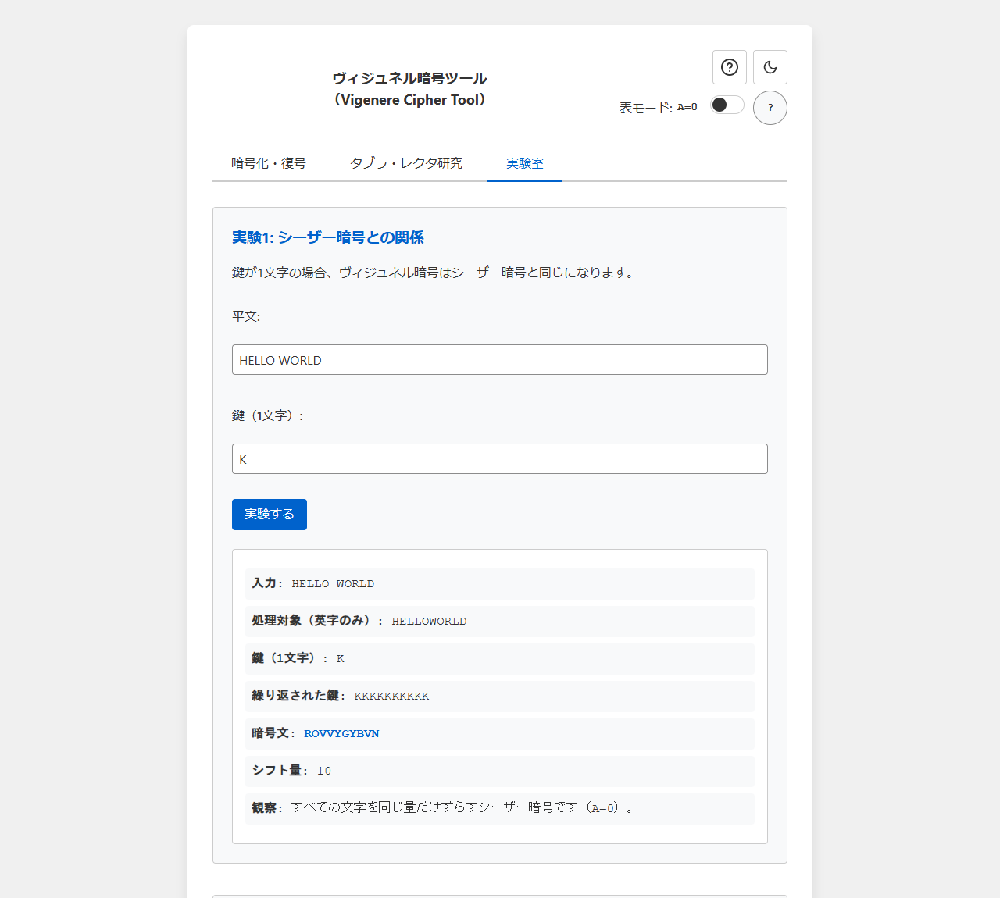

<!--
---
id: day017
slug: vigenere-cipher-tool

title: "Vigenere Cipher Tool"

subtitle_ja: "古典暗号を学ぶインタラクティブツール"
subtitle_en: "Interactive tool for learning classical cryptography"

description_ja: "ヴィジュネル暗号の暗号化・復号、タブラ・レクタ研究、シーザー暗号・ワンタイムパッドの実験ができる包括的な古典暗号学習ツール"
description_en: "A comprehensive classical cryptography learning tool for Vigenère cipher encryption/decryption, tabula recta research, and experiments with Caesar cipher and one-time pad"

category_ja:
  - 古典暗号
  - 換字式暗号
category_en:
  - Classical Cryptography
  - Substitution Cipher

difficulty: 3

tags:
  - vigenere-cipher
  - classical-cryptography
  - polyalphabetic-substitution-cipher
  - tabula-recta
  - caesar-cipher
  - one-time-pad

repo_url: "https://github.com/ipusiron/vigenere-cipher-tool"
demo_url: "https://ipusiron.github.io/vigenere-cipher-tool/"

hub: true
---
-->

# Vigenere Cipher Tool - ヴィジュネル暗号の学習ツール


[](https://ipusiron.github.io/vigenere-cipher-tool/)

**Day017 - 生成AIで作るセキュリティツール100**

Vigenere Cipher Toolは、ブラウザー内でヴィジュネル暗号の暗号化・復号と文字の対応を学べるツールです。
タブラ・レクタの研究、シーザー暗号とワンタイムパッドの実験を3つのタブで行えます。

---

## 🌐 デモページ

👉 [https://ipusiron.github.io/vigenere-cipher-tool/](https://ipusiron.github.io/vigenere-cipher-tool/)

---

## 📸 スクリーンショット


> *A=0でATTACK AT DAWNを暗号化した結果と、平文・鍵・出力の対応表。*


> *空白と大文字小文字を保つ形式。ダークテーマで検証メッセージも確認できます。*


> *HとKからSを求める式と、表の交点のハイライト。*


> *HELLO WORLDと鍵Kによる暗号文と、シフト量10。*

---

## ✨ 主要機能

### 📝 タブ1: 暗号化・復号

**🔐 基本的な暗号化機能**
- **暗号化・復号**: 平文 ⇔ 暗号文の相互変換
- **スマート入力処理**: 全角英字はエラー、その他の英字以外は無視（書式を保つ形式ではそのまま出力）
- **ファイル入出力**: 
  - 📁 ファイル選択ボタンでテキストファイル読み込み
  - ドラッグ&ドロップによるファイル読み込み
  - 📋 ワンクリック結果コピー機能
- **リアルタイム検証**: 入力内容に応じた警告・エラーメッセージ表示

**📊 高度な可視化機能**
- **処理対象テキスト**: 実際に処理される英字のみの表示
- **文字対応テーブル**: 平文・鍵・出力の文字を列で並べて対応関係を可視化
- **インタラクティブハイライト**: テーブルセルにマウスホバーでヴィジュネル表の該当部分をハイライト
- **完全なヴィジュネル表**: 26×26のタブラ・レクタを常時表示
- **固定ヘッダー**: 長いテキストでもスクロール時に列ラベルが常に見える

### 🔬 タブ2: タブラ・レクタ研究

**🧮 暗号化メカニズムの研究**
- **文字別暗号化研究**: 
  - 平文文字（A-Z）と鍵文字（A-Z）を選択
  - 暗号文字の計算結果を即座に表示
  - 数式: `暗号文字 ← shift(平文, 鍵)`
- **数学的計算過程の表示**:
  - 文字 → 数値変換（A=0モード: A=0〜Z=25、A=1モード: A=1〜Z=26）
  - モジュロ26演算の詳細: `(平文 + 鍵) mod 26`（A=1でも同じ式で、0は26と読む）
  - 数値 → 文字変換の過程

**🔄 逆算機能（復号研究）**
- **鍵文字の特定**: 
  - 平文文字と暗号文字から使用された鍵文字を逆算
  - 数式: `鍵文字 ← findKey(平文, 暗号文)`
  - 逆算の数学的過程: `(暗号文 - 平文) mod 26`（負の剰余は0〜25に直す。A=1の0は26と読む）

**🎯 インタラクティブ学習**
- **ヴィジュネル表ハイライト**: 選択した文字組み合わせを表でハイライト表示
- **リアルタイム計算**: 文字選択と同時に計算結果を更新

### 🧪 タブ3: 実験室

**🔤 シーザー暗号実験**
- **1文字鍵の特殊性**: ヴィジュネル暗号で鍵が1文字 = シーザー暗号
- **シフト量の可視化**: 選択した鍵文字によるシフト量（A=0モードは0〜25、A=1モードは1〜26）を表示
- **繰り返し鍵の表示**: 1文字鍵がテキスト全体に繰り返される様子を可視化
- **シーザー暗号との比較**: ヴィジュネル暗号の特殊ケースとしての理解促進

**🎲 ワンタイムパッド実験**
- **ランダム鍵自動生成**: 
  - 平文の英字数と同じ長さの鍵を生成
  - crypto.getRandomValuesで生成し、棄却サンプリングで26文字の偏りをなくす
- **ワンタイムパッドの原理の観察**:
  - 情報理論的安全性の概念を体験
  - 鍵の長さ = 平文の英字数の重要性
- **詳細な文字対応表**: 
  - 各文字ペアの変換過程をテーブルで表示
  - 鍵の使い捨て性質の理解促進

ブラウザーが作る乱数であり、本物のワンタイムパッドの運用（鍵の配送・破棄）までは再現しません。
平文の英字数が変わると鍵を消し、再生成するまで実験できません。

### 🎨 全体的なUI/UX機能

**🌙 テーマ・表示**
- **ダークモード**: ライト/ダーク テーマ切り替え（設定自動保存）
- **表モード切替（A=0 / A=1）**: ヴィジュネル表の計算方式を切り替え可能
  - A=0モード: A=0, B=1, ..., Z=25（一般的な方式、A+A=A）
  - A=1モード: A=1, B=2, ..., Z=26（一部の文献で使用、A+A=B）
- **レスポンシブデザイン**: デスクトップ・タブレット・モバイル対応
- **アクセシビリティ**: キーボードナビゲーション、ESCキーでモーダル閉じる

**📖 学習サポート**
- **包括的ヘルプモーダル**: 全機能の詳細な使い方ガイド
- **ツールチップ**: ヴィジュネル表の各セルにホバーで詳細情報
- **段階的エラー表示**: 警告（無視可能）とエラー（処理停止）の区別

---

## 📖 使い方

### 📝 タブ1: 基本的な暗号化・復号

**基本操作**
1. **モード選択**: 「暗号化」または「復号」を選択
2. **テキスト入力**: 
   - 手動入力: 暗号化したい平文、または復号したい暗号文を入力
   - ファイル読み込み: 📁アイコンをクリックしてファイル選択
   - ドラッグ&ドロップ: テキストファイルを入力欄に直接ドロップ
3. **鍵の入力**: 暗号化・復号に使用する鍵を英字で入力（例: `LEMON`）
4. **実行**: 「実行」ボタンをクリックすると結果が表示
5. **結果取得**: 📋 コピーアイコンで結果をクリップボードにコピー

**可視化の活用**
- **文字対応テーブル**: 平文・鍵・出力の対応関係を確認
- **インタラクティブ学習**: テーブルセルにマウスを合わせてヴィジュネル表の動作を理解
- **処理対象確認**: 実際に暗号化される英字のみのテキストをチェック

### 🔬 タブ2: タブラ・レクタ研究

**暗号化研究**
1. **文字選択**: 平文文字（A-Z）と鍵文字（A-Z）をドロップダウンから選択
2. **計算実行**: 選択と同時に結果を表示。「計算」ボタンでも同じ処理を実行
3. **数式確認**: モジュロ26演算の詳細な計算過程を確認
4. **表ハイライト**: ヴィジュネル表で該当する交点セルがハイライト

**復号研究（逆算）**
1. **逆算実行**: 平文文字と暗号文字から鍵文字を特定
2. **計算式理解**: `(暗号文 - 平文) mod 26`（負の剰余は0〜25に直す。A=1の0は26と読む） の仕組みを学習
3. **応用学習**: 既知の平文・暗号文ペアから鍵を推測する手法を理解

### 🧪 タブ3: 実験室

**シーザー暗号実験**
1. **平文入力**: 暗号化したいテキストを入力
2. **1文字鍵設定**: A-Zの中から1文字を選択
3. **実験実行**: シーザー暗号としての結果を確認
4. **比較理解**: ヴィジュネル暗号の特殊ケースとしてのシーザー暗号を理解

**ワンタイムパッド実験**
1. **平文入力**: 実験したいテキストを入力
2. **鍵自動生成**: 「ランダム鍵生成」ボタンで平文の英字数と同じ長さの鍵を生成
3. **暗号化実行**: 同じ長さの鍵を使った暗号化を体験
4. **結果分析**: 文字ごとの対応表で一度きりの鍵使用の重要性を理解

### 出力形式と入力上限

| 出力形式 | 扱い |
|---|---|
| 詰めて出力 | 英字のみを大文字で出力 |
| 5文字ごとに区切る | 英字の結果を5文字ずつ空白で区切る。貼り付けて復号可能 |
| 書式を保つ | 空白・記号・数字・非ASCIIを残し、英字の大文字小文字を保持 |

入力上限は100,000文字（UTF-16コード単位）、UTF-8ファイルは1MBです。上限を超える入力は先頭だけを読み込み、画面に警告します。
対応表は先頭1,000文字（英字）まで表示しますが、出力欄には処理結果の全文が入ります。
全角英字は半角に直してから実行してください。
`?text=TOM%20%26%20JERRY`のようなURLパラメーターからも読み込めます。読み込み後はURLからtextを消します。

### 動作例

| 平文 | 鍵 | 表モード | 出力形式 | 結果 |
|---|---|---|---|---|
| ATTACK AT DAWN | LEMON | A=0 | 詰めて出力 | LXFOPVEFRNHR |
| ATTACK AT DAWN | LEMON | A=1 | 詰めて出力 | MYGPQWFGSOIS |
| ATTACK AT DAWN | LEMON | A=0 | 5文字ごとに区切る | LXFOP VEFRN HR |
| Attack at dawn! | LEMON | A=0 | 書式を保つ | Lxfopv ef rnhr! |
| Attack at dawn! | LEMON | A=1 | 書式を保つ | Mygpqw fg sois! |
| HELLO | KEY | A=0 | 詰めて出力 | RIJVS |
| HELLO WORLD | K | A=0 | 詰めて出力 | ROVVYGYBVN |
| CRYPTO IS SHORT FOR CRYPTOGRAPHY | ABCD | A=0 | 詰めて出力 | CSASTPKVSIQUTGQUCSASTPIUAQJB |

### 💡 効果的な学習方法

**段階的学習アプローチ**
1. **基礎理解** (タブ1): まず基本的な暗号化・復号操作に慣れる
2. **仕組み理解** (タブ2): 個別文字の変換メカニズムを深く研究
3. **応用理解** (タブ3): 関連する暗号方式との比較で理解を深める

**実践的な使い方**
- 短い単語から始めて段階的に長いテキストに挑戦
- 異なる長さの鍵で暗号化の性質の変化を観察
- ヴィジュネル表のハイライト機能を活用して視覚的に理解
- 数式表示で数学的背景を確認

---

## ⚠️ ヴィジュネル暗号の弱点

ヴィジュネル暗号は、シーザー暗号を強化した多表式換字式暗号として知られていますが、現代の観点からは以下のような明確な弱点を持ちます。

### 鍵の繰り返しによる周期性

短い鍵を使うと、暗号化のパターンが繰り返されるため、暗号文にも周期性が現れます。  
この性質を利用して、**カシスキーテスト（Kasiski Test）** により鍵長を特定し、各部分をシーザー暗号として分解できます。

### 鍵が漏れるとすべて破られる

鍵が再利用される場合、一度でも漏洩すると同じ鍵で暗号化されたメッセージはすべて復号可能です。  
これは **ワンタイムパッド（使い捨て鍵）** との大きな違いです。

### 頻度解析に弱い

鍵の長さが分かった場合、暗号文を複数のシーザー暗号に分割できるため、**頻度解析によって平文を逆算**される危険性があります。

### 現代的攻撃への耐性がない

- 既知平文攻撃（Known Plaintext Attack）
- 選択平文攻撃（Chosen Plaintext Attack）
- 選択暗号文攻撃（Chosen Ciphertext Attack）

などの基本的な攻撃に対して、暗号構造的に防御手段がありません。

### 非英字への非対応

ヴィジュネル暗号は原理的に **A〜Zの26文字** に限定されており、記号・数字・日本語などを直接扱うことができません。

### 結論

> ヴィジュネル暗号は教育・学習用には適していますが、現代の通信やセキュリティには使用できません。

---

## 🏆 ツールを活用した実績

### 🎮 暗号解読ゲーム「Cypher」の攻略

- [POLYALPHABETIC SUBSTITUTION PUZZLE 01【Cypher編】](https://akademeia.info/?p=36228)
  - A=1版のヴィジュネル表を利用。本ツールの「表モード: A=1」で対応可能。
- [POLYALPHABETIC SUBSTITUTION PUZZLE 02【Cypher編】](https://akademeia.info/?p=36245)
- [POLYALPHABETIC SUBSTITUTION PUZZLE 03【Cypher編】](https://akademeia.info/?p=36264)

### 🎤 ヴィジュネル暗号文の解読デモ

- [ゆるいハッキング大会で「古典暗号のビジュアル解読法」を発表してきました](https://akademeia.info/?p=43255)
  - 本ツールを用いることで、リアルタイムに解読できた。

---

## 🔬 技術的な説明

### 使用技術
- **フロントエンド**: HTML5, CSS3, Vanilla JavaScript (ES6+)
- **ライブラリー**: 外部ライブラリーなし
- **アーキテクチャ**: モジュラー設計（JS・CSS共に分離）

### 実装の詳細

本ツールの実装技術、コアアルゴリズム、設計判断の詳細については、以下の技術解説ドキュメントを参照してください。

📚 **[技術解説 - TECHNICAL.md](TECHNICAL.md)**

- コアアルゴリズムの数学的基盤
- モジュラーアーキテクチャの設計
- CSS設計パターンとデザインシステム
- 入力検証と視覚化エンジンの実装
- 開発過程で得られた技術的教訓


## 🔒 セキュリティとプライバシー

処理はすべてブラウザー内で行い、ツールから外部への通信は0件です。
入力・鍵・出力は保存せず、localStorageに保存するのはテーマと表モードだけです。
保存領域が利用できなくても動作します。

meta CSPはscript-srcとstyle-srcをselfに限定し、connect-srcはnoneにしています。
インライン実行・動的コード評価は許可しません。利用者の入力はDOM APIで表示します。
metaではframe-ancestorsが無効なため、埋め込み禁止を強制するにはHTTPヘッダーを設定できる配信環境が必要です。

鍵はcrypto.getRandomValuesで生成し、234以上のバイトを捨ててから26で割った余りを使います。
この棄却サンプリングで文字の偏りをなくしていますが、現代の秘密情報の保護に本ツールを使わないでください。

## 🧪 テスト

Node 22以上で`npm test`を実行します。依存パッケージはありません。
GitHub Actionsでpushとpull_requestのたびに同じテストを実行します。
暗号の既知解答、数式、入力境界、乱数、配色、READMEの動作例も検証します。

## 🔗 関連リンク

- [『暗号技術のすべて』](https://akademeia.info/?page_id=157) P.71-81
- [『シーザー暗号の解読法』](https://akademeia.info/?page_id=37037) P.90-93
- [『Pythonでいかにして暗号を破るか　古典暗号解読プログラムを自作する本』](https://akademeia.info/?page_id=94) P.333-422

---

## 📁 ディレクトリー構造

```
vigenere-cipher-tool/
├── .github/
│   └── workflows/
│       └── test.yml        # Node 22のテスト
├── .gitignore
├── CLAUDE.md
├── LICENSE
├── README.md
├── TECHNICAL.md
├── assets/
│   ├── screenshot.png
│   ├── screenshot2.png
│   ├── screenshot3.png
│   ├── screenshot4.png
│   ├── screenshot5.png
│   └── screenshot6.png
├── css/
│   ├── base/
│   │   └── variables.css
│   ├── components/
│   │   ├── buttons.css
│   │   ├── forms.css
│   │   ├── icons.css
│   │   ├── messages.css
│   │   ├── modal.css
│   │   ├── tables.css
│   │   └── tabs.css
│   ├── layout/
│   │   ├── container.css
│   │   └── grid.css
│   ├── main.css
│   ├── themes/
│   │   ├── dark.css
│   │   └── light.css
│   └── utilities/
│       ├── animations.css
│       └── print.css
├── favicon.svg
├── index.html
├── js/
│   ├── app.js
│   ├── core/
│   │   ├── cipher.js       # 純粋な暗号処理と出力形式
│   │   ├── formula.js
│   │   ├── indexing-mode.js
│   │   ├── input.js
│   │   ├── random.js
│   │   ├── utils.js
│   │   └── validation.js
│   ├── features/
│   │   ├── lab-tab.js
│   │   ├── main-tab.js
│   │   └── research-tab.js
│   ├── theme-init.js
│   └── ui/
│       ├── dom-elements.js
│       ├── message-display.js
│       ├── table-generator.js
│       ├── tabs.js
│       └── theme.js
├── package.json           # 依存なし・npm test
└── test/
    ├── cipher.test.js
    ├── contrast.test.js
    ├── format.test.js
    ├── formula.test.js
    ├── helpers.js
    ├── html.test.js
    ├── input.test.js
    ├── random.test.js
    ├── readme.test.js
    ├── static.test.js
    └── validation.test.js
```

---

## 💻 動作環境

モダンブラウザーに対応しています。ES moduleを使うため、file://ではCORS制約で動きません。
次の手順で配信し、http://localhost:8000/を開いてください。

### ローカルでの実行
```bash
# リポジトリーをクローン
git clone https://github.com/ipusiron/vigenere-cipher-tool.git

# ディレクトリーに移動
cd vigenere-cipher-tool

# ローカルサーバーを起動
python -m http.server 8000
```

### カスタマイズ
- **テーマ**: `css/themes/`でライト・ダークテーマを変更可能
- **デザインシステム**: `css/base/variables.css`で統一的なデザイン調整
- **機能拡張**: モジュラー構造により機能追加が容易

### 技術詳細
実装の技術的詳細については **[TECHNICAL.md](TECHNICAL.md)** を参照してください。

---

## 📄 ライセンス

MIT License - [LICENSE](LICENSE)ファイルを参照

---

## 🛠️ このツールについて

本ツールは、「生成AIで作るセキュリティツール100」プロジェクトの一環として開発されました。このプロジェクトでは、AIの支援を活用しながら、セキュリティに関連するさまざまなツールを100日間にわたり制作・公開していく取り組みを行っています。

プロジェクトの詳細や他のツールについては、以下のページをご覧ください。

🔗 [https://akademeia.info/?page_id=42163](https://akademeia.info/?page_id=42163)
